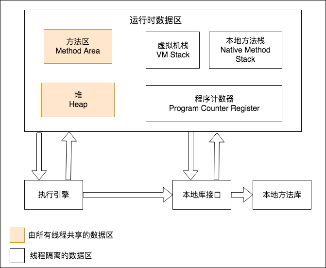

**深入理解Java虚拟机-读书笔记**

# 第一部分 走近Java

## 第 1 章 走近Java


# 第二部分 自动内存管理机制

## 第 2 章 Java 内存区域与内存溢出异常

### 2.1 概述


### 2.2  运行时数据区域




#### 2.2.1 程序计数器

1. 是一块儿较小的内存空间，当前线程所执行的字节码的行号指示器

2. 字节码解释器工作时通过改变计数器的值来选取下一条需要执行的字节码指令

3. 分支、循环、跳转、异常处理、线程回复等基础功能都需要依赖这个计数器

4. 每条线程独立程序计数器，互不影响，独立存储，这类内存区域为“线程私有”的内存

5. 执行Java方法，记录正在执行的训你几字节码指令的地址；Native方法，这个值为空

   ```
   此内存区域是唯一没有规定任何OutOfMemoryError情况的区域
   ```


#### 2.2.2 Java虚拟机栈

1. 线程私有，生命周期与线程相同

2. 描述的是Java方法执行的内存模型

3. 每个方法执行的同时都会创建一个栈帧，用于存储局部变量表、操作数栈、动态链接、方法出口等信息

4. “栈”，即虚拟机栈，或者虚拟机栈中局部变量表部分

5. 局部变量表存放了编译期可知的各种基本数据类型、对象引用和renturnAddress类型（指向一条字节码指令的地址）

6. 64位长度的long和double类型占用2个局部变量空间（Slot），其余1个

7. 局部变量表所需的空间再编译期间完成分配

8. 这个区域两种异常情况

   ```
   1）如果线程请求的栈深度大于虚拟机所允许的深度，将抛出StackOverflowError异常
   2）如果虚拟机栈可以动态扩展，扩展到无法申请到足够内存时，就会抛出OutOfMemoryError异常
   ```

   

#### 2.2.3 本地方法栈

1. 作用与虚拟机栈非常相识

2. 虚拟机使用到的Native方法服务

3. 两种异常

   ```
   1）如果线程请求的栈深度大于虚拟机所允许的深度，将抛出StackOverflowError异常
   2）如果虚拟机栈可以动态扩展，扩展到无法申请到足够内存时，就会抛出OutOfMemoryError异常
   ```

   

#### 2.2.4 Java堆

1. Java堆是被所有线程**共享**的一块内存区域，在虚拟机启动时创建
2. 唯一目的就是存放对象实例
3. 所有对象实例以及数组都要在对上分配
4. 是垃圾收集器管理的主要区域
5. 现在收集器基本都采用分代收集算法，分为新生代和老年代，再细致的有Eden空间，From Survivor空间，To Survivor空间等
6. Java堆可以处于物理上不连续的内存空间中，只要逻辑上是连续的即可
7. 扩展通过-Xmx和Xms控制
8. 堆无法扩展内存时，抛出**OutOfMemoryError**异常


#### 2.2.5 方法区

1. 各个线程共享的内存区域
2. 用于存储已被虚拟机加载的类信息、常量、静态变量 、及时编译器编译后的代码等数据
3. 堆的一个逻辑部分，别名：非堆，与Java堆区分开来
4. 限制非常宽松，还可以选择不实现垃圾收集
5. 无法扩展内存时，抛出**OutOfMemoryError**异常


#### 2.2.6 运行时常量池

1. 是方法区的一部分
2. 用于存放编译期生成的各种字面量和符号引用，类加载后进入存储
3. 相对于Class文件常量池具备动态性，运行也可能存放到池中，利用最多的是String的**intern()**方法
4. 无法扩展内存时，抛出**OutOfMemoryError**异常


#### 2.2.7 直接内存

1. NIO引入基于通道与缓冲区的I/O方式，可使用Native函数库直接分配堆外的内存，然后通过一个存储在Java堆中的DirectByteBuffer对象作为这块内存的引用进行操作
2. 无法扩展内存时，抛出**OutOfMemoryError**异常


## 第 3 章 垃圾收集器与内存分配策略


## 第 4 章 虚拟机性能监控与故障处理工具


## 第 5 章 调优案例分析与实战


# 第三部分 虚拟机执行子系统

## 第 6 章 类文件结构


## 第 7 章 虚拟机类加载机制


## 第 8 章 虚拟机字节码执行引擎


## 第 9 章 类加载及执行子系统的案例与实战


# 第四部分 程序编译与代码优化

## 第 10 章 早期（编译期）优化


##  第 11 章 晚期（运行期）优化


# 第五部分 高效并发

## 第 12 章 Java内存模型与线程


## 第 13 章 线程安全与锁优化


